# AP-Flow — App Spec & Build Ladder

**Slug:** `ap-flow` · **Domain:** Operational Accounting · **Phases:** 10–11
**Status: Phase 10 done.** `config/apps.ts` marks it `'building'`. Phase 10's checkboxes below are ticked; Phase 11's are not — see [roadmap.md](roadmap.md#phase-10-as-delivered) for what was actually delivered, including the deliberate deviations from this ladder.

AP-Flow turns a photograph of a receipt into a balanced, auditable journal entry. It keeps no ledger of its own — it posts into LedgerCore via `source_type = 'ap_flow'` and `source_id` pointing at its own document row ([guardrails.md](guardrails.md) rule 16).

**Gated on LedgerCore.** It needs `journalService` to post (Phase 3), the `fx_rates` table for historical rate lookup at invoice date (Phase 8), the audit trail its provenance claims depend on (Phase 5), and the job queue, because OCR and a vision call are far too slow to run inside a request (Phase 7).

---

## Core technical capabilities

### A. Multimodal document parsing — Phase 10

Accepts PDFs, PNGs and JPEGs of vendor bills, receipts and multi-page invoices. Multi-page PDFs are rasterized per page before extraction.

Unstructured visual data becomes structured JSON:

```json
{
  "vendor_name": "AWS Cloud Services",
  "invoice_number": "INV-2026-8901",
  "invoice_date": "2026-08-15",
  "currency": "USD",
  "subtotal_cents": 45000,
  "tax_cents": 0,
  "total_cents": 45000,
  "line_items": [
    { "description": "EC2 Compute Instances", "amount_cents": 35000 },
    { "description": "S3 Storage Usage",      "amount_cents": 10000 }
  ]
}
```

**Money is integer cents at the boundary, not decimals.** The spec's original JSON used `450.00`; the parser converts on the way in, because `JSON.parse` produces an IEEE-754 double and rule 3 does not have an exception for "it was only in transit". Extraction is rejected if `subtotal_cents + tax_cents ≠ total_cents` or if the line items do not sum to the subtotal — an arithmetic contradiction means the read was wrong, and the reviewer should see it flagged rather than have it silently posted.

### B. Accounting-aware account mapping — Phase 11

GL coding is inferred in a deliberate order, cheapest and most explainable first:

1. **The organization's own history.** `ap_flow_vendor_account_map` records which account this organization posted this vendor to last time, with a hit count. A vendor seen ten times needs no inference at all.
2. **Account-name and code matching** against the org's chart for an unseen vendor.
3. **The model**, only when the first two produce nothing — and its answer is a *suggestion* with a confidence score, written to `suggested_account_id`, never to the ledger.

Worked examples, using the real seeded codes:

| Document | Debit | Credit |
|---|---|---|
| AWS cloud bill, on account | `6120` Software & IT Infrastructure | `2100` Accounts Payable |
| Hardware vendor receipt, paid by card | `1500` Fixed Assets / Equipment | `1110` Operating Cash |

Every suggestion is a suggestion. Nothing reaches the ledger without a human accepting it in the review queue.

### C. Tax & currency normalization — Phase 11

- **Input tax is split out** of the total into its own line rather than buried in the expense: GST/VAT goes to `1180 GST/VAT Input Credit`, which is an asset — a claim against the tax authority, not a cost of doing business. Getting this wrong overstates expenses and loses a refund.
- **Foreign currency is detected** from the document and normalized through LedgerCore's `fx_rates` at the **invoice date**, not today's rate. An August invoice booked at September's rate is wrong, and it is exactly the error that produces the FX gain/loss that [LedgerCore's Phase 8](ledger-core.md#3-realized-fx--the-worked-example) then has to post on settlement.

### D. Human-in-the-loop review queue — Phase 11

- **Per-field confidence.** Each extracted field carries a 0–1 score; the UI colours the low ones yellow and red. Blurry thermal-printer receipts fail on totals far more often than on vendor names, and the reviewer's attention should go where the model is least sure.
- **Side-by-side review.** The original document image next to the extracted values, so verification is a glance rather than a re-entry.
- **One-click post & verify.** Approval hands the confirmed data to LedgerCore's `journalService` inside one transaction. Until then nothing exists in the ledger — the draft lives entirely in AP-Flow's own tables.

---

## What makes this more than an OCR demo

### 1. PII redaction that is actually true

The claim is that raw documents undergo PII redaction *before* image data is transmitted to an external model. That claim is easy to make and easy to get wrong, because **you cannot regex a JPEG.** Sending the image and then stripping PII out of the response is a different, much weaker thing.

The pipeline that makes the claim literally true:

```mermaid
flowchart LR
  U[Upload<br/>PDF · PNG · JPEG] --> S[Hash-addressed store<br/>SHA-256]
  S --> R[Rasterize<br/>PDF pages → images]
  R --> O[Local OCR<br/>text + bounding boxes]
  O --> D[PII detector<br/>card numbers · national IDs · names]
  D --> M[Mask pixels<br/>paint over the boxes]
  M --> V[Claude Vision<br/>structured extraction]
  V --> C[COA mapping<br/>history → chart → model]
  C --> Q[Review queue<br/>per-field confidence]
  Q -->|accountant approves| GL[(LedgerCore GL<br/>immutable)]
```



OCR runs **locally** and returns text *with bounding boxes*. The detector locates card numbers (Luhn-checked, not just sixteen digits), national identifiers, and personal names in that local text. The corresponding pixel regions are painted over on the image buffer. Only the redacted raster ever leaves the machine. The boxes that were masked are stored as `redacted_regions` JSONB, so the redaction decision is itself auditable.

**The honest limitation, which the tests must state and this doc must not overstate:** OCR bounding boxes are approximate, and a missed box means PII reaches a third party — precisely the failure this feature exists to prevent. This needs its own test corpus and a measured recall figure. Until that exists, the claim is "redaction pipeline implemented", not "PII cannot leak."

### 2. Multi-line-item splitting

Most OCR bookkeeping tools extract the invoice total and stop. AP-Flow parses individual line items and maps different lines on one document to **different** GL accounts.

A single supermarket receipt splits across `6130 Office Supplies` and `6140 Kitchen & Breakroom` — two debits, one credit, one balanced entry. That is what an actual bookkeeper does with that receipt, and it is why the two accounts are in the [default chart](schema.md#default-chart-of-accounts) from Phase 3.

### 3. Provenance you can walk backwards

The created journal entry carries `source_type = 'ap_flow'`, `source_id` = the document row, and the document's **SHA-256**. An auditor holding a ledger line can reach the exact image bytes it came from, and verify by hash that those bytes have not changed since extraction.

Files are named by their hash for the same reason: a corrupted or substituted file cannot masquerade as the original. `UNIQUE (org_id, sha256)` means uploading the same receipt twice is one document, not a duplicate posting.

**AP-Flow no longer owns storage.** Upload, MIME sniffing, hashing, the filesystem backend and the `put`/`get`/`stat` interface were promoted to platform infrastructure on 2026-09-10 and are delivered by **Phase 9.5**, the Document Vault — LedgerCore, BoardDeck and TaxGuard AI all need files too, and leaving the store inside AP-Flow would have every other app reading AP-Flow's tables, which rule 16 forbids. Phase 10 **consumes** `services/storageService.ts` and the platform `documents` table, and attaches its own domain rows to a document through `document_links`. Note one behavioural difference the promotion brought: storage paths are keyed by organization (`server/storage/<org_id>/…`), not globally content-addressed, so two tenants uploading identical bytes get two blobs. See [roadmap.md](roadmap.md#phase-renumbering--2026-09-10).

---

## Build ladder

### Phase 10 — capture & extraction

Produces a draft. Posts nothing to the ledger.

- [x] `config/apps.ts` — flip `ap-flow` from `'planned'` to `'building'`
- [x] ~~Upload endpoint~~ / ~~`storageService`~~ — **delivered by Phase 9.5** (2026-09-10), not built here. Phase 10 consumes `POST /api/v1/documents` and `services/storageService.ts`
- [x] `ap_flow_documents`, `ap_flow_extractions` migrations — plus a third table, `ap_flow_pages` (per-page raster/redaction metadata), not in this ladder's original two-table sketch. `ap_flow_documents` references the platform `documents` row rather than holding the bytes' location itself
- [x] PDF rasterization, page by page
- [x] Local OCR returning text with bounding boxes
- [x] `services/redactionService.ts` — shared, unprefixed; detection + pixel masking; `redacted_regions` persisted
- [x] Claude Vision extraction to the schema above, with per-field confidence
- [x] Arithmetic validation: line items sum to subtotal, subtotal + tax = total — **flags** (`arithmeticOk: false`), never silently accepts or auto-rejects, since nothing posts yet
- [x] Queued as a background job (Phase 7) — registration returns `201` immediately; the job runs async, not a returned job handle to poll
- [x] Vision calls stubbed in tests — never a live API call in CI
- [x] Cross-tenant isolation test under `__tests__/ap-flow/` — at both the API layer and the worker/handler layer

**Acceptance ✅ — verified.** A fixture receipt containing a card number produces a redacted image in which those pixels are demonstrably altered, verified by comparing the region before and after (`redaction.test.ts`) — not by trusting that the code ran. No test makes a network call or needs `ANTHROPIC_API_KEY`.

### Phase 11 — mapping, review & posting

- [ ] `ap_flow_line_items`, `ap_flow_vendor_account_map` migrations
- [ ] History-first COA classification, model only as fallback
- [ ] Tax split into `1180` / `2140`
- [ ] FX normalization at invoice date via LedgerCore's `fx_rates`
- [ ] Review queue UI: side-by-side document, confidence colouring, per-line account override
- [ ] One-click post → `journalService` with `source_type`, `source_id`, document hash
- [ ] Approval is `ACCOUNTANT` or above; upload is any member

**Acceptance:** a two-line receipt posts one balanced entry debiting two different accounts. Re-approving the same document does not create a second entry. The posted entry's `source_id` resolves back to a document whose stored bytes still hash to the recorded SHA-256.

---

## Not built yet

Phase 11 only: `ap_flow_line_items` and `ap_flow_vendor_account_map` as real tables (line items stay JSONB on `ap_flow_extractions` until then), history-first COA classification, tax split into `1180`/`2140`, FX normalization at invoice date, the review-queue UI (side-by-side document, confidence colouring, per-line account override), and the one-click post into `journalService`. Nothing in Phase 10 writes `journal_entries` or `ledger_lines`, directly or otherwise.

Also not built, beyond Phase 11's own scope: a measured PII-detection recall figure (the honest claim stays "redaction pipeline implemented," never "PII cannot leak" — see the redaction section above), handwriting or non-English OCR, multi-document PDF splitting, duplicate-invoice detection, and re-extraction history (a re-extract replaces the prior attempt in `ap_flow_extractions`; only `audit_logs` remembers it existed).

When a phase lands, tick its boxes and update [roadmap.md](roadmap.md), [api.md](api.md), [schema.md](schema.md) and `CLAUDE.md` in the same change.
