# AP-Flow — App Spec & Build Ladder

**Slug:** `ap-flow` · **Domain:** Operational Accounting · **Phases:** 10–11, 19, 19.1, 19.2
**Status: Phases 10, 11, 19, 19.1 and 19.2 all done.** Google Drive intake, deferred at Phase 19, shipped in Phase 19.2 — then **moved to the platform in Phase 19.3** (not an AP-Flow phase; see [roadmap.md](roadmap.md#phase-193-as-delivered) and [api.md](api.md#integrations--apiv1integrationsdrive--phase-193)). AP-Flow still *receives* files imported this way, unchanged — it just no longer owns the connection. `config/apps.ts` marks it `'building'`. See [roadmap.md](roadmap.md#phase-10-as-delivered), [roadmap.md](roadmap.md#phase-11-as-delivered), [roadmap.md](roadmap.md#phase-19-as-delivered), [roadmap.md](roadmap.md#phase-191-as-delivered) and [roadmap.md](roadmap.md#phase-192-as-delivered) for what was actually delivered.

AP-Flow turns a photograph of a receipt into a balanced, auditable bill in LedgerCore. It keeps no ledger of its own — since Phase 19 it posts a real bill via `billService`'s `*OnClient` functions, so the resulting journal entry carries `source_type = 'bill'` and `source_id` pointing at that bill, exactly as if a human had entered and approved it directly ([guardrails.md](guardrails.md) rule 16). (Phase 11 originally posted a raw journal entry with `source_type = 'ap_flow'`; that broke AP aging's reconciliation against the ledger and is why Phase 19 rewrote it — see [roadmap.md](roadmap.md#phase-19-as-delivered).)

**Gated on LedgerCore.** It needs `journalService` to post (Phase 3), the `fx_rates` table for historical rate lookup at invoice date (Phase 8), the audit trail its provenance claims depend on (Phase 5), and the job queue, because OCR and a vision call are far too slow to run inside a request (Phase 7).

---

## Core technical capabilities

### A. Multimodal document parsing — Phase 10

Accepts PDFs, PNGs and JPEGs of vendor bills, receipts and multi-page invoices. Multi-page PDFs are rasterized per page before extraction.

Unstructured visual data becomes structured JSON:

```json
{
  "vendor_name": "AWS Cloud Services",
  "invoice_number": "INV-2026-8901",
  "invoice_date": "2026-08-15",
  "currency": "USD",
  "subtotal_cents": 45000,
  "tax_cents": 0,
  "total_cents": 45000,
  "line_items": [
    { "description": "EC2 Compute Instances", "amount_cents": 35000 },
    { "description": "S3 Storage Usage",      "amount_cents": 10000 }
  ]
}
```

**Money is integer cents at the boundary, not decimals.** The spec's original JSON used `450.00`; the parser converts on the way in, because `JSON.parse` produces an IEEE-754 double and rule 3 does not have an exception for "it was only in transit". Extraction is rejected if `subtotal_cents + tax_cents ≠ total_cents` or if the line items do not sum to the subtotal — an arithmetic contradiction means the read was wrong, and the reviewer should see it flagged rather than have it silently posted.

### B. Accounting-aware account mapping — Phase 11

GL coding is inferred in a deliberate order, cheapest and most explainable first:

1. **The organization's own history.** `ap_flow_vendor_account_map` records which account this organization posted this vendor to last time, with a hit count. A vendor seen ten times needs no inference at all.
2. **Account-name and code matching** against the org's chart for an unseen vendor.
3. **The model**, only when the first two produce nothing — and its answer is a *suggestion* with a confidence score, written to `suggested_account_id`, never to the ledger.

Worked examples, using the real seeded codes:

| Document | Debit | Credit |
|---|---|---|
| AWS cloud bill, on account | `6120` Software & IT Infrastructure | `2100` Accounts Payable |
| Hardware vendor receipt, paid by card | `1500` Fixed Assets / Equipment | `1110` Operating Cash |

Every suggestion is a suggestion. Nothing reaches the ledger without a human accepting it in the review queue.

### C. Tax & currency normalization — Phase 11

- **Input tax is split out** of the total into its own line rather than buried in the expense: GST/VAT goes to `1180 GST/VAT Input Credit`, which is an asset — a claim against the tax authority, not a cost of doing business. Getting this wrong overstates expenses and loses a refund.
- **Foreign currency is detected** from the document and normalized through LedgerCore's `fx_rates` at the **invoice date**, not today's rate. An August invoice booked at September's rate is wrong, and it is exactly the error that produces the FX gain/loss that [LedgerCore's Phase 8](ledger-core.md#3-realized-fx--the-worked-example) then has to post on settlement.

### D. Human-in-the-loop review queue — Phase 11

- **Per-field confidence.** Each extracted field carries a 0–1 score; the UI colours the low ones yellow and red. Blurry thermal-printer receipts fail on totals far more often than on vendor names, and the reviewer's attention should go where the model is least sure.
- **Side-by-side review.** The original document image next to the extracted values, so verification is a glance rather than a re-entry.
- **One-click post & verify.** Approval hands the confirmed data to LedgerCore's `journalService` inside one transaction. Until then nothing exists in the ledger — the draft lives entirely in AP-Flow's own tables.

---

## What makes this more than an OCR demo

### 1. PII redaction that is actually true

The claim is that raw documents undergo PII redaction *before* image data is transmitted to an external model. That claim is easy to make and easy to get wrong, because **you cannot regex a JPEG.** Sending the image and then stripping PII out of the response is a different, much weaker thing.

The pipeline that makes the claim literally true:

```mermaid
flowchart LR
  U[Upload<br/>PDF · PNG · JPEG] --> S[Hash-addressed store<br/>SHA-256]
  S --> R[Rasterize<br/>PDF pages → images]
  R --> O[Local OCR<br/>text + bounding boxes]
  O --> D[PII detector<br/>card numbers · national IDs · names]
  D --> M[Mask pixels<br/>paint over the boxes]
  M --> V[Claude Vision<br/>structured extraction]
  V --> C[COA mapping<br/>history → chart → model]
  C --> Q[Review queue<br/>per-field confidence]
  Q -->|accountant approves| GL[(LedgerCore GL<br/>immutable)]
```



OCR runs **locally** and returns text *with bounding boxes*. The detector locates card numbers (Luhn-checked, not just sixteen digits), national identifiers, and personal names in that local text. The corresponding pixel regions are painted over on the image buffer. Only the redacted raster ever leaves the machine. The boxes that were masked are stored as `redacted_regions` JSONB, so the redaction decision is itself auditable.

**The honest limitation, which the tests must state and this doc must not overstate:** OCR bounding boxes are approximate, and a missed box means PII reaches a third party — precisely the failure this feature exists to prevent. This needs its own test corpus and a measured recall figure. Until that exists, the claim is "redaction pipeline implemented", not "PII cannot leak."

### 2. Multi-line-item splitting

Most OCR bookkeeping tools extract the invoice total and stop. AP-Flow parses individual line items and maps different lines on one document to **different** GL accounts.

A single supermarket receipt splits across `6130 Office Supplies` and `6140 Kitchen & Breakroom` — two debits, one credit, one balanced entry. That is what an actual bookkeeper does with that receipt, and it is why the two accounts are in the [default chart](schema.md#default-chart-of-accounts) from Phase 3.

### 3. Provenance you can walk backwards

The created journal entry carries `source_type = 'ap_flow'`, `source_id` = the document row, and the document's **SHA-256**. An auditor holding a ledger line can reach the exact image bytes it came from, and verify by hash that those bytes have not changed since extraction.

Files are named by their hash for the same reason: a corrupted or substituted file cannot masquerade as the original. `UNIQUE (org_id, sha256)` means uploading the same receipt twice is one document, not a duplicate posting.

**AP-Flow no longer owns storage.** Upload, MIME sniffing, hashing, the filesystem backend and the `put`/`get`/`stat` interface were promoted to platform infrastructure on 2026-09-10 and are delivered by **Phase 9.5**, the Document Vault — LedgerCore, BoardDeck and TaxGuard AI all need files too, and leaving the store inside AP-Flow would have every other app reading AP-Flow's tables, which rule 16 forbids. Phase 10 **consumes** `services/storageService.ts` and the platform `documents` table, and attaches its own domain rows to a document through `document_links`. Note one behavioural difference the promotion brought: storage paths are keyed by organization (`server/storage/<org_id>/…`), not globally content-addressed, so two tenants uploading identical bytes get two blobs. See [roadmap.md](roadmap.md#phase-renumbering--2026-09-10).

---

## Build ladder

### Phase 10 — capture & extraction

Produces a draft. Posts nothing to the ledger.

- [x] `config/apps.ts` — flip `ap-flow` from `'planned'` to `'building'`
- [x] ~~Upload endpoint~~ / ~~`storageService`~~ — **delivered by Phase 9.5** (2026-09-10), not built here. Phase 10 consumes `POST /api/v1/documents` and `services/storageService.ts`
- [x] `ap_flow_documents`, `ap_flow_extractions` migrations — plus a third table, `ap_flow_pages` (per-page raster/redaction metadata), not in this ladder's original two-table sketch. `ap_flow_documents` references the platform `documents` row rather than holding the bytes' location itself
- [x] PDF rasterization, page by page
- [x] Local OCR returning text with bounding boxes
- [x] `services/redactionService.ts` — shared, unprefixed; detection + pixel masking; `redacted_regions` persisted
- [x] Claude Vision extraction to the schema above, with per-field confidence
- [x] Arithmetic validation: line items sum to subtotal, subtotal + tax = total — **flags** (`arithmeticOk: false`), never silently accepts or auto-rejects, since nothing posts yet
- [x] Queued as a background job (Phase 7) — registration returns `201` immediately; the job runs async, not a returned job handle to poll
- [x] Vision calls stubbed in tests — never a live API call in CI
- [x] Cross-tenant isolation test under `__tests__/ap-flow/` — at both the API layer and the worker/handler layer

**Acceptance ✅ — verified.** A fixture receipt containing a card number produces a redacted image in which those pixels are demonstrably altered, verified by comparing the region before and after (`redaction.test.ts`) — not by trusting that the code ran. No test makes a network call or needs `ANTHROPIC_API_KEY`.

### Phase 11 — mapping, review & posting

- [x] `ap_flow_line_items`, `ap_flow_vendor_account_map` migrations
- [x] History-first COA classification, model only as fallback
- [x] Tax split into `1180` — **corrected from this ladder's original "`1180` / `2140`."** `2140 GST/VAT Output Payable` is the sales/output side; AP-Flow is a purchase-side app and never writes to it. See the C section above, which already had this right
- [x] FX normalization at invoice date via LedgerCore's `fx_rates`
- [x] Review queue UI: side-by-side document, confidence colouring, per-line account override
- [x] One-click post → `journalService` with `source_type`, `source_id`, document hash
- [x] Approval is `ACCOUNTANT` or above; upload is any member

**Acceptance ✅ — verified.** A two-line receipt posts one balanced entry debiting two different accounts (`posting.test.ts`). Re-approving the same document returns `409` and creates no second entry. The posted entry's `source_id` resolves back to a document whose stored bytes still hash to the recorded SHA-256.

### Phase 19 — automated intake

- [x] A second extraction/classification provider (Gemini), env-selected via `AP_FLOW_AI_PROVIDER`, behind one `StructuredModelClient` seam — no new dependency, `fetch` only
- [x] Posting rewritten onto a real LedgerCore bill (`createCapturedBillOnClient` + `approveBillOnClient`), fixing AP aging's reconciliation and making AP-Flow payables payable through `/payments`
- [x] Vendor find-or-create by normalized name, race-safe via a transaction-scoped advisory lock
- [x] Tax allocated across bill lines by the largest-remainder method (`utils/money.ts`'s `allocateCents`), exact to the cent
- [x] Duplicate-invoice detection, for free, via `ux_bills_vendor_reference`
- [x] `due_date` extracted, defaulting to invoice date + 30 days when absent
- [x] Confidence-gated auto-post, off by default per organization, every gate reported at once
- [x] Direct upload from AP-Flow's own page (`POST /documents/upload`), vaulting and registering in one call
- [x] Google Drive folder intake — **delivered in Phase 19.2** (see [roadmap.md](roadmap.md#phase-192-as-delivered))

**Acceptance ✅ — verified.** The full server suite (1451 tests) and client suite (247 tests) pass with zero regressions. `npm run verify:integrity` and a full 24-month sandbox reseed both pass green against the rewritten posting path.

---

### Phase 19.1 — AI token/cost metering

- [x] Every extraction and classification call recorded to the platform's `ai_model_calls` table — tokens, latency, outcome, and cost when the model carries a verified price
- [x] `costMicroUsd` in millionths of a US dollar (`utils/microUsd.ts`), never `Cents`, never reaching the GL
- [x] A model with no verified price records its real tokens with `cost_micro_usd NULL`, surfaced to the reader as `unpricedCallCount` rather than silently omitted
- [x] Recording through an injected callback so `extractionService.ts`/`mappingService.ts` stay database-free; a metering failure never fails a document
- [x] Per-document cost visible on the document detail page; an AP-Flow "AI usage" page with totals and per-model/per-purpose/per-day breakdowns

**Acceptance ✅ — verified.** See [roadmap.md](roadmap.md#phase-191-as-delivered).

---

### Phase 19.2 — Google Drive folder intake — moved to the platform in Phase 19.3

- [x] Per-org OAuth 2.0 + PKCE Drive connection (`drive.readonly`), hand-rolled `fetch`, no `googleapis` SDK
- [x] Refresh token and PKCE verifier AES-256-GCM encrypted at rest (`INTEGRATION_ENCRYPTION_KEY`)
- [x] A background sweep polls every connected organization every 5 minutes; `POST /drive/sync` for an immediate check
- [x] A file is imported at most once per organization, even across a reconnect (`ap_flow_drive_files`, keyed by Drive file id)
- [x] Imported files flow through the same `captureFile` path direct upload uses — metered, extracted, classified, and auto-posted (if enabled) with no special case
- [x] `invalid_grant` on refresh moves the connection to `NEEDS_REAUTH` rather than failing the sync loudly

**Acceptance ✅ — verified, at the time.** See [roadmap.md](roadmap.md#phase-192-as-delivered).

**Superseded by Phase 19.3 (platform, not AP-Flow).** The connection, its two tables, and every route above moved to `/api/v1/integrations/drive` — service-account auth added alongside the retained OAuth path, many folders per org instead of one, each routed by purpose (`VENDOR_BILL` still reaches AP-Flow's `captureFile` exactly as above; `BANK_STATEMENT` reaches LedgerCore instead). Nothing in AP-Flow's own pipeline changed — a Drive-imported vendor bill is metered, extracted, classified and auto-posted exactly as this section describes. See [roadmap.md](roadmap.md#phase-193-as-delivered).

---

## Not built

Not built, and deliberately out of scope for Phase 11 despite appearing elsewhere as a one-line mention — corrected in [roadmap.md](roadmap.md#phase-11-as-delivered) once the discrepancy was noticed: **3-way matching and COGS tracking.** Neither is in this file's own Phase 11 ladder or acceptance criteria above, which are what this doc treats as authoritative.

Phase 19 left one item of its own original scope unbuilt — **Google Drive folder intake** — and Phase 19.2 built it; see [roadmap.md](roadmap.md#phase-192-as-delivered). Also not built by Phase 19: per-org AI provider choice (one server-wide env var selects the provider for every organization); auto-post re-evaluation after a manual line-item edit; posting or auto-posting a negative line item (a credit note); an outbox event or webhook on an auto-post.

Not built by Phase 19.2, **as it shipped that day** — several of these were addressed by Phase 19.3's rework, noted inline: per-org AI provider choice, still true today — Drive-imported files use the same one server-wide `AP_FLOW_AI_PROVIDER`; a second Drive folder or a second connected Google account per organization (**addressed in 19.3** — many purposed folders per connection are now supported, though still one connection per org); OAuth application verification with Google (**side-stepped in 19.3** — a service-account connection needs no Google review at all; the retained OAuth path still carries this gap); Drive push notifications, still true today — polling only, no public HTTPS endpoint exists for this dev setup to receive one; an outbox event or webhook firing on an import, still true today. Not built by Phase 19.1: retention or partitioning on `ai_model_calls` despite unbounded growth (the same accepted posture `audit_logs` already carries); a cached-input pricing rate distinct from the plain input rate (irrelevant today since AP-Flow sends no `cache_control`, but a real over-estimate the moment prompt caching is introduced — `config/aiPricing.ts` says so).

Also not built: editing an extracted amount (only the account per line is editable — a wrong number is fixed by re-extracting, which discards prior overrides); un-posting or reversing from AP-Flow's own side (correction is LedgerCore's `POST /journals/:id/reverse`, reached from the linked journal entry — `POSTED` has no outbound edge in AP-Flow's own FSM); an outbox event or webhook firing on a posting; open-item or partial-document posting; duplicate-invoice detection; a measured PII-detection recall figure (the honest claim stays "redaction pipeline implemented," never "PII cannot leak" — see the redaction section above); handwriting or non-English OCR; multi-document PDF splitting; and re-extraction history (a re-extract replaces the prior attempt in `ap_flow_extractions`, and now also its materialized line items; only `audit_logs` remembers either existed).

When a phase lands, tick its boxes and update [roadmap.md](roadmap.md), [api.md](api.md), [schema.md](schema.md) and `CLAUDE.md` in the same change.
