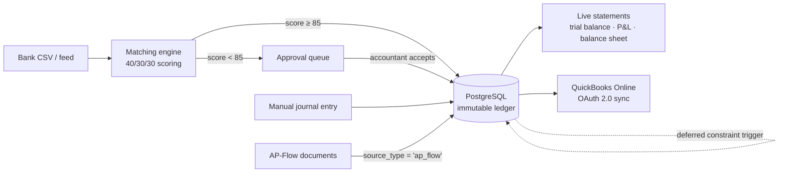

# LedgerCore — App Spec & Build Ladder

**Slug:** `ledger-core` · **Domain:** Core Accounting & Systems · **Phases:** 3–4, 6, 8, 9b, 17
**Status: Phase 3 through Phase 9b shipped.** The GL core is live — chart of accounts, journal entries, reversing entries, trial balance, with the balance invariant and immutability enforced by database triggers — LedgerCore has a front door (onboarding, settings, dashboard), a journal register with filters plus a per-account ledger with running balances and chart-wide rollups, navigation/confirmation UX (back links, collapsible chart, confirm-before-reverse), sales invoicing (customers, invoice settings, draft → issue → void posting a real balanced entry), accounts payable with settlement (vendors, a four-state bill approval workflow, payments against either invoices or bills, AR/AP aging reconciled to the GL), live financial statements (fiscal periods with a close/lock lifecycle and a database-enforced posting guard, plus P&L and the balance sheet, both computed from raw `ledger_lines` with no summary table), bank reconciliation (CSV statement import idempotent by dedupe hash, a hand-written 40/30/30 confidence-matching engine, an approval queue, and a reconciliation report against the GL), the multi-currency FX engine (exchange rates with a latest-on-or-before lookup, foreign-currency invoices/bills/payments, realized settlement gain/loss, and period-end unrealized revaluation with an automatic next-day reversal), and now a way in for a business migrating off another system — a staged chart-of-accounts importer and a staged opening-balance importer, each validated before one all-or-nothing commit. Phase 17 is unticked below — no QuickBooks sync. Keep this file verified against the filesystem, not against its own claims.

LedgerCore is the system of record. The other six apps do not keep their own ledgers — they post into this one through `journal_entries.source_type` / `source_id`, and read nothing of each other's tables ([guardrails.md](guardrails.md) rule 16).

The thesis it exists to demonstrate: **99% of bookkeepers cannot code, and 99% of engineers cannot explain a debit.** Everything below is chosen to sit on that seam — correct accounting, enforced by real engineering.

---

## Feature scope

### A. Enforced double-entry engine — Phase 3

- **Atomic zero-sum transactions.** Every financial event is at least two posting lines where `SUM(debits) − SUM(credits) = 0`. An unbalanced `POST` rolls the transaction back; nothing partial survives.
- **The invariant is enforced twice, at two layers.** `journalService` validates before writing, and a `DEFERRABLE INITIALLY DEFERRED` constraint trigger re-checks at `COMMIT`. The application being correct is not the reason the ledger balances — see [Why the trigger, given the service already checks](#why-the-trigger-given-the-service-already-checks).
- **Immutable append-only ledger.** No `UPDATE`, no `DELETE` on a posted entry — refused by trigger, not by convention, and there is no route that could offer one. Corrections are reversing entries carrying `reverses_entry_id` back to the original.
- **Multi-currency recorded from the first row.** Every line stores its native currency, the base-currency amounts, and the FX rate used on the transaction date. Phase 8 builds the engine that consumes this; Phase 3 refuses to write rows that would make Phase 8 impossible.

### B. Live financial statements — Phase 4

Computed by aggregation over raw `ledger_lines` on every request. **No pre-calculated summary tables, no nightly rollup job, no `account_balances` column that can drift from the lines it summarises.**

- **Trial balance** (Phase 3) — per-account debit and credit totals, type-aware `net_balance`, and an `isBalanced` flag that is integer equality.
- **Profit & Loss** — Revenue − Expenses, with gross profit split out via the `5xxx` COGS range.
- **Balance Sheet** — Assets = Liabilities + Equity, with current-period earnings folded into equity.
- **Fiscal periods** with close/lock, so a closed month cannot receive a late posting.
- ~~**AR/AP subledgers**~~ — delivered early, in Phase 3.9: `GET /reports/ar-aging`/`ap-aging`, receivable/payable detail reconciled to their control accounts.

### C. Bank reconciliation & confidence matching — Phase 6

- **Statement ingestion.** Messy real-world CSV exports: quoted fields containing commas and newlines, a BOM, inconsistent date formats, debit/credit in one signed column or two unsigned ones. Re-importing the same statement is idempotent via `UNIQUE (org_id, dedupe_hash)`.
- **Scoring engine.** Each bank line is scored against open AR/AP items out of 100:

  | Signal | Points | Rule |
  |---|---|---|
  | Amount | 40 | Exact integer-cent match |
  | Date | 30 | Within ±3 days of the document date, scaled by distance |
  | Counterparty | 30 | Levenshtein similarity on normalized name + memo |

- **Thresholds.** ≥85 is offered for one-click auto-reconciliation; anything below routes to the interactive approval queue. Every score stores its `score_breakdown` as JSONB, so a suggestion is explainable rather than a number the user is asked to trust.
- **Levenshtein is hand-written** in `utils/levenshtein.ts` — a rolling-array DP, `O(m×n)` time and `O(min(m,n))` space. No dependency, and the algorithm is one you can derive on a whiteboard.

### D. Multi-currency FX engine — Phase 8

- `fx_rates` keyed by `(base, quote, date)`, looked up as *the latest rate on or before* the transaction date — rate feeds have weekend and holiday gaps, so an exact-date match is a bug waiting for a Saturday.
- **Realized** gain/loss posted automatically on settlement, when the rate on the payment date differs from the rate on the invoice date.
- **Unrealized** revaluation of open foreign-currency balances at period end.

### E. QuickBooks Online sync — Phase 17

- OAuth 2.0 authorization-code flow, per-organization `realm_id`, tokens encrypted at rest and never logged.
- Push reconciled entries to `/v3/company/{realmId}/journalentry`.
- **Shipping honestly:** this phase is built against Intuit's documented API shape with `fetch` stubbed in tests. There is no sandbox account yet, so it lands as *wired, not verified against live Intuit*, and says exactly that until someone runs it against a real sandbox.

---

## The showcase items

### 1. Audit trail & internal controls — the CFO safety net — ✅ shipped, Phase 5

An append-only history stamping actor, timestamp, system source, and client IP on every financial write. The shared CDC trail is [Phase 5, as delivered](roadmap.md#phase-5-as-delivered); LedgerCore was its first consumer.

The mechanism worth explaining in an interview: **a Postgres trigger cannot see `req`.** It knows the row and the transaction, not who made the HTTP call. The actor reaches it through `set_config('app.current_user_id', $1, true)` and `set_config('app.client_ip', $2, true)` issued inside the same transaction (the function form, not `SET LOCAL` directly — only the function form accepts a bind parameter), read back by the trigger with `current_setting('app.current_user_id', true)`. The `true`/`is_local` flag scopes the value to the transaction, so a pooled connection handed to the next request carries nothing over. See [study/postgresql/audit-triggers-and-session-variables.md](../study/postgresql/audit-triggers-and-session-variables.md).

Alongside it, `npm run verify:integrity` — a standalone checker asserting total debits equal total credits across the entire database, that every entry balances individually, and that no line is orphaned. It is the script you run in front of an auditor, and `server/src/__tests__/integrity.test.ts` proves it is capable of failing. See [study/postgresql/integrity-checking-a-ledger.md](../study/postgresql/integrity-checking-a-ledger.md).

### 2. Multi-tenant chart of accounts

GAAP/IFRS account types with parent-child hierarchy — `1000 Assets → 1100 Current Assets → 1110 Operating Cash` — resolved with a `WITH RECURSIVE` CTE, cycle-checked before any re-parenting is accepted. Header accounts carry `is_postable = false` and are refused by trigger if anything tries to post to them.

Every organization gets its own copy of the [default chart](schema.md#default-chart-of-accounts) at registration, seeded inside the same transaction that creates the organization. Two organizations may both own account code `1110` and can never see each other's.

### 3. Realized FX — the worked example

An invoice raised for **$1,000 USD** on day 1 when USD/INR is **83.00**, settled on day 10 when it is **83.50**. Base currency is INR.

**Day 1 — invoice raised.** 1,000 × 83.00 = ₹83,000.

| Account | Debit | Credit |
|---|---|---|
| `1120` Accounts Receivable | ₹83,000.00 | |
| `4200` Service Revenue | | ₹83,000.00 |

**Day 10 — cash received.** The same $1,000 is now worth 1,000 × 83.50 = ₹83,500. The receivable was carried at ₹83,000, so ₹500 more came in than was booked.

| Account | Debit | Credit |
|---|---|---|
| `1110` Operating Cash | ₹83,500.00 | |
| `1120` Accounts Receivable | | ₹83,000.00 |
| `4910` Realized FX Gain | | ₹500.00 |

The entry balances because the FX line is what makes it balance — that is the whole point of the account. **Note the direction:** a *receivable* settled at a higher rate is a gain. The mirror case, the one in the original spec, is a $1,000 *payable*: you owe $1,000, booked at ₹83,000, and it costs ₹83,500 to clear, so you debit `6810 Realized FX Loss` ₹500. Same arithmetic, opposite sign, because a liability moves the other way.

All three amounts are `BIGINT` paise/cents. The rate is `NUMERIC(18,8)`. Nothing here is ever a float.

---

## Architectural differentiation

### Why the trigger, given the service already checks

Most applications enforce accounting rules in application code and describe that as "validated". It holds exactly as long as every write goes through that code path — and then someone writes a data-fix script, a migration backfills a column, an ORM bulk-updates, or a future module posts through a service that forgot a check.

A `DEFERRABLE INITIALLY DEFERRED` constraint trigger closes that off. It fires at `COMMIT` rather than per statement, so an entry's lines can be inserted one at a time without ever being transiently invalid, and it evaluates the same integer equality the service does. The result is that **an unbalanced entry cannot exist in the database**, regardless of what wrote it — including a hand-typed `INSERT` in `psql`.

That is the difference between a rule and an invariant, and it is worth being able to say out loud.

### Data flow

### Webhooks for financial events — Phase 7 ✅ delivered

Phase 7 is shared infrastructure, not one of LedgerCore's own phases (3–4, 6, 8–9 above) — but LedgerCore is the source of every event it fires, so the feature is recorded here too. An outbound, HMAC-signed notification fires when one of five things happens: an invoice is issued, a bill is approved, a payment is recorded, a fiscal period is closed, or an unmatched bank line exceeds a configurable threshold. This landed in Phase 7 and not earlier for a specific reason — rule 5 forbids post-`COMMIT` follow-up work inside the posting function. An HTTP call to a receiver cannot happen inside the transaction (it would hold the connection open on a network round trip, and a rollback could not un-send it), and firing it after `COMMIT` without a queue means a crash between the two silently loses the notification. The fix actually built is a transactional outbox: `outboxService.emitEvent` writes an event row on the *same* transaction client as the posting itself, and a separate background drain turns that row into a signed webhook delivery. Full detail: [roadmap.md#phase-7-as-delivered](roadmap.md#phase-7-as-delivered), [api.md](api.md), [study/architecture/transactional-outbox.md](../study/architecture/transactional-outbox.md).

---

## Build ladder

Deliverables per phase. Acceptance criteria are the bar for ticking the phase, not aspirations.

### Phase 3 — GL core

- [x] `utils/money.ts` — branded `Cents`, parsing and formatting, no floats
- [x] `zod` adopted; `src/schemas/` layer + `utils/parseBody.ts` bridging zod errors to `ApiError(400)`
- [x] `002_ledger-core_accounts.sql` — `accounts` with `parent_id`, `is_postable`
- [x] `accountService` — list (tree and flat), create, re-parent with cycle check, `seedDefaultChart`
- [x] Chart seeded inside `/auth/register`'s existing transaction
- [x] `003_ledger-core_backfill_chart.sql` — the seed for every organization created in Phases 1–2
- [x] `004_ledger-core_journals.sql` — `journal_entries`, `ledger_lines`, both deferred constraint triggers, `reject_mutation()`, the `is_postable` guard
- [x] `journalService.createEntry` — one `BEGIN…COMMIT`, every statement on the checked-out client
- [x] `POST /:id/reverse` — the only correction path
- [x] `reportService.trialBalance` — type-aware `net_balance`, integer `isBalanced`
- [x] `express-rate-limit` on `/auth/login` and `/auth/register` — debt carried since Phase 1
- [x] Tailwind v4 + `lucide-react`; accounts, journal-entry and trial-balance pages; first real entry in `client/src/apps/registry.ts`
- [x] Cross-tenant isolation test under `__tests__/ledger-core/`

**Acceptance ✅ — all verified.** A hand-written `INSERT` of two unbalanced lines in `psql` succeeds on both inserts and fails at `COMMIT`. An entry with zero lines and an entry with one line both fail at `COMMIT`. `UPDATE`/`DELETE` on `journal_entries` and `ledger_lines` raise `0A000`. `SELECT SUM(debit_cents) - SUM(credit_cents) FROM ledger_lines` returns `0`. A second organization's account id under the first organization's session returns `404`, not `403`. Covered by `__tests__/ledger-core/ledgerConstraints.test.ts`, which writes raw SQL rather than going through the service.

**One thing Phase 3 does *not* claim.** Every line is written in the organization's base currency at `fx_rate = 1`. The currency columns exist and are populated, but nothing converts anything yet — the FX engine is Phase 8.

### Phase 3.5 — onboarding, settings & dashboard

A half-step between the GL core and live statements. Renumbers nothing; every box below Phase 4 stays exactly where it was.

- [x] `005_ledger-core_settings.sql` — `ledger_settings` (one row per org, keyed by `org_id`), plus `UNIQUE (org_id, id)` on `accounts` so `cash_account_id` carries a composite FK rather than a plain one
- [x] `settingsService.completeOnboarding` — one transaction, idempotent (resubmitting overwrites, never 409s), writes `organizations.name`/`base_currency` via `organizationService.updateOrganization` on the same client
- [x] The base-currency lock — `422` if any `ledger_lines` row exists and the submitted currency differs from the current one
- [x] `dashboardService.dashboardSummary` — position, year-to-date/month-to-date performance, a 6-point gap-filled trend, recent entries, integrity — one `FILTER`-aggregate scan plus a `generate_series` scaffold, **no summary table**
- [x] `GET/POST/PATCH /ledger-core/settings`, `GET /ledger-core/reports/dashboard`, `PATCH /organizations` (platform layer)
- [x] Client: sidebar navigation, onboarding wizard (3 steps), dashboard with a hand-rolled `TrendChart`, settings page, reports index (trial balance live, P&L/balance sheet marked "Phase 4")
- [x] Cross-tenant isolation tests for both `settings.test.ts` and `dashboard.test.ts`

**Acceptance ✅ — all verified.** A newly registered user picking LedgerCore is redirected to the wizard, never the chart of accounts; completing it once and reloading never shows the wizard again. `GET /ledger-core/settings` on a fresh organization returns `200` with `onboardedAt: null`, never `404`. Posting a journal entry after onboarding with a different base currency returns `422`; with the same currency, `200`. The dashboard's `trend` always has exactly 6 points, including months with no postings, at zero. Covered by `__tests__/ledger-core/{settings,dashboard}.test.ts`.

**What this phase does *not* claim.** `position.equationHolds` is not the Phase 4 balance sheet — it folds `currentEarningsCents` (Revenue − Expenses, all time) into the check by hand, because there is no period-end close to derive retained earnings from yet. No `fiscal_periods` row exists anywhere; `fiscal_year_start_month`/`_day` are a setting consumed in application code, not a table. The cash tile is `null` until an organization explicitly configures a cash account.

### Phase 3.6 — journal register & account ledger

A half-step, like 3.5. Renumbers nothing; every box below Phase 4 stays exactly where it was. **No migration** — every query here is served by tables and indexes Phase 3 already built.

- [x] `GET /ledger-core/journals` gains `page`/`limit`/`from`/`to`/`accountId`/`sourceType`/`q` filters, a shared predicate builder (`journalService.buildFilters`) so `totalCount` can never disagree with the returned page, and an `e.id DESC` pagination tiebreaker
- [x] Every `JournalEntry` gains `createdByName`/`createdByEmail` (denormalised from the platform `users` table), `reversedByEntryId` (the inverse of `reversesEntryId` — set on an original once it has been reversed), and `totalDebitCents`/`totalCreditCents`
- [x] `GET /ledger-core/accounts/:id/ledger` (new `accountLedgerService.ts`) — one postable account's opening balance, every line oldest-first with a running balance computed by a `SUM(...) OVER (...)` window function over the full filtered set (continues correctly across pages), period totals, closing balance, and the counterpart accounts on each entry. Header accounts refused with `422`
- [x] `GET /ledger-core/accounts/balances` — own and subtree-rollup balance for every account (including headers and inactive accounts), via a descendant-walking recursive CTE mirroring `wouldCreateCycle`'s ancestor walk in the opposite direction. Registered before `/:id` so `balances` is never matched as an account id
- [x] Client: `JournalEntryPage` split into `JournalsPage` (the register), `NewJournalEntryPage` (posting), `JournalDetailPage` (one entry — no edit/delete affordance, only Reverse); `AccountLedgerPage` (opening/closing balance tiles, filterable transaction table with a running balance); `AccountsPage` gains a balance column and links postable rows into their ledger
- [x] Cross-tenant isolation tests for all three: `journals.test.ts` (filter leakage, forged `orgId`), `accountLedger.test.ts` (another org's account id → `404`), `accounts.test.ts`'s new `describe('account balances')` (another org's balances stay zero)
- [x] Two study notes: [window-functions-and-running-totals.md](../study/postgresql/window-functions-and-running-totals.md) (new), extensions to [aggregating-a-ledger.md](../study/postgresql/aggregating-a-ledger.md), [recursive-ctes-and-hierarchies.md](../study/postgresql/recursive-ctes-and-hierarchies.md) and [routing-nested-and-dynamic-segments.md](../study/react/routing-nested-and-dynamic-segments.md)

**Acceptance ✅ — all verified.** `?from=`/`?to=`/`?accountId=`/`?q=` each narrow the register correctly and `totalCount` always matches the filtered page, asserted with a same-predicate pagination-stability test across 5 same-date entries. An account ledger's running balance continues correctly from page 1 into page 2 rather than restarting (asserted directly). A header account's `GET .../ledger` returns `422`; its `rollupBalanceCents` on `GET .../balances` still sums its whole subtree, and a leaf's rollup equals its own balance. `GET /accounts/balances` is not shadowed by `/:id`. 280 server tests (up from 230), 65 client tests (up from 51).

**What this phase does *not* claim.** No sequential, human-readable entry number (`JE-000123`) — the register shows the first 8 characters of the uuid instead; adding one needs a per-org sequence and a migration. A header account's balance rolls up; its *transaction list* does not — clicking a header still shows no ledger, by design. No CSV/PDF export. No fiscal periods, close/lock, P&L, or balance sheet — those are still entirely Phase 4.

### Phase 3.7 — ledger navigation and chart editing

A third half-step, client-only. **No migration, no new server route, no new dependency.**

- [x] Journal register gains a per-row Actions column (View, Duplicate, Reverse), replacing the date-cell link; Reverse offered only when neither a reversal nor already reversed, mirroring `JournalDetailPage`'s `canReverse` rule
- [x] Duplicate opens `journals/new?copyFrom=<id>`, seeding the post form once from an existing entry (effect + `seeded` latch, not a live binding) — the substitute for edit, which does not and will not exist
- [x] Trial balance's account name and the account ledger's Reference cell are now links, closing the navigation loop chart → ledger → entry → account
- [x] Chart of accounts gains a create form (`NewAccountForm`), reachable from a header button and an empty-chart prompt, posting to the already-existing `POST /ledger-core/accounts`

**Acceptance ✅ — all verified.** 79 client tests (up from 65); server suite unchanged at 280, confirming no server code moved.

**What this phase does *not* claim.** No client-side role gating — every action is shown to every member, and the server's `requireRole` is the only enforcement.

### Phase 3.8 — sales invoicing

A fourth half-step. **No renumbering** — Phase 4 is unaffected and unstarted. Two pieces of scope: the navigation/confirmation gaps left by 3.5–3.7, and LedgerCore's first AR source document.

- [x] `ConfirmDialog` gates reversing a journal entry (from both the register and the detail page), issuing an invoice, and voiding an invoice — a hand-rolled `role="dialog"` component, not `window.confirm`
- [x] `BackLink` on every drill-down page; a journal line's account **name** also links into its ledger; the chart of accounts' header rows collapse (`aria-expanded`), starting expanded
- [x] `006_platform_organization_tax_ids.sql` — `organizations.tax_number`/`business_number`, edited via the existing `PATCH /organizations`
- [x] `007_ledger-core_invoice_settings.sql` — `ledger_invoice_settings`: numbering (prefix/padding/counter), defaults (due days, tax rate, posting accounts), branding/disclosure. No seed row, same "absence means unconfigured" posture as `ledger_settings`
- [x] `008_ledger-core_customers.sql` — `customers`, retired via `is_active = false`, no DELETE route
- [x] `009_ledger-core_invoices.sql` — `invoices`/`invoice_lines`; `reject_issued_invoice_mutation()` (a `to_jsonb` row-diff permitting only the `ISSUED -> VOID` transition, touching only `status`/`voided_at`/`void_journal_entry_id`) and `reject_non_draft_invoice_line_mutation()` (absolute once the parent leaves `DRAFT`)
- [x] `010_ledger-core_invoice_lines_org_index.sql` — a same-phase guardrail-review follow-up adding the `(org_id, invoice_id)` index `invoice_lines` was missing
- [x] `journalService.createEntryOnClient`/`reverseEntryOnClient` — the existing posting/reversal logic minus its own `BEGIN`/`COMMIT`, taking the caller's transaction client, so `invoiceService` can post a real journal entry inside the *invoice's* own transaction
- [x] `utils/money.ts` gains `scaleCents` — money × a rational factor in exact `BigInt` arithmetic (basis points for tax, thousandths for quantity), half-up rounding; tax computed per line and summed, never on a pre-summed subtotal
- [x] `invoiceService.issueInvoice` — allocates the next number from a locked counter row, posts one balanced entry (debit receivable, credit each distinct revenue account, credit tax if any), never writes `journal_entries`/`ledger_lines` directly
- [x] `invoiceService.voidInvoice` — posts a reversing entry if `ISSUED`; no GL posting at all if still `DRAFT`
- [x] `/api/v1/ledger-core/customers` (4 routes), `/api/v1/ledger-core/invoices` (7 routes, including `/:id/issue` and `/:id/void`), `/api/v1/ledger-core/settings/invoicing` (2 routes) — full detail in [api.md](api.md)
- [x] Client: a `Create` menu in the rail; `InvoicesPage`, `NewInvoicePage` (create and edit, one page), `InvoiceDetailPage` (printable, honoring invoice-settings disclosure/branding), `CustomersPage`, `InvoiceSettingsPage`, a shared `SettingsTabs` strip
- [x] Cross-tenant isolation tests for every new module: `organizations.test.ts`, `invoiceSettings.test.ts`, `customers.test.ts`, `invoices.test.ts`; `invoiceConstraints.test.ts` proves both triggers via raw SQL, bypassing the service entirely
- [x] Three new study notes ([document-lifecycle-fsm.md](../study/architecture/document-lifecycle-fsm.md), [gapless-numbering-and-counters.md](../study/postgresql/gapless-numbering-and-counters.md), [accessible-dialogs-and-focus.md](../study/react/accessible-dialogs-and-focus.md)) plus extensions to [deferred-constraint-triggers.md](../study/postgresql/deferred-constraint-triggers.md) and [branded-types-for-money.md](../study/typescript/branded-types-for-money.md)

**Acceptance ✅ — all verified.** Issuing an invoice allocates a sequential number and posts a balanced entry (`sourceType: 'invoice'`) visible in the journal register; the receivable/revenue/tax split is correct for a mixed-tax-rate fixture; voiding an issued invoice posts a reversal and the trial balance stays balanced; a raw-SQL `UPDATE` on an `ISSUED` invoice's amount, or an `INSERT`/`DELETE` on its lines, raises `0A000`, while the `ISSUED -> VOID` transition succeeds when it touches only the permitted columns. 340 server tests (up from 280), 94 client tests (up from 84).

**What this phase does *not* claim.** No `PAID` status and no payment/cash-receipt document — an issued invoice's receivable never clears except by voiding, and the UI says so. No AR aging, no AR subledger *report* (Phase 4 still owns that), no PDF export, no multi-currency invoices (needs the Phase 8 FX engine), no fiscal-period posting lock, no audit trail (Phase 5, delivered since). **Payment recording and AR/AP aging landed in Phase 3.9, immediately below.**

### Phase 3.9 — accounts payable & payments

A fifth half-step. **No renumbering** — Phase 4 is otherwise unaffected. This phase pays off the "AR/AP subledgers" line item Phase 4's box below used to own; that box is now ticked here instead.

- [x] `011_ledger-core_vendors.sql` — `vendors`, the AP mirror of `customers` (plus `payment_terms`), retired via `is_active = false`, no DELETE route
- [x] `012_ledger-core_ap_posting_accounts.sql` — three nullable AP posting-account columns on `ledger_settings` (`payable_account_id`, `tax_input_account_id`, `default_expense_account_id`), each a composite FK to `accounts`
- [x] `013_ledger-core_bills.sql` — `bills`/`bill_lines`, a **four-state** FSM (`DRAFT`/`AWAITING_APPROVAL`/`POSTED`/`VOID`, plus a recall edge `AWAITING_APPROVAL -> DRAFT`) — entry and approval are separate acts of trust, gated to different roles server-side; `reject_posted_bill_mutation()` and `reject_locked_bill_line_mutation()` mirror invoices' pair, widened to two mutable states
- [x] `014_ledger-core_payments.sql` — `payments`/`payment_allocations`; a payment is born `POSTED`, never a draft. A **pair** of deferred constraint triggers: `assert_payment_allocations_complete()` (mirrors `journal_entries`' parent-completeness check) and `assert_no_overallocation()` (a genuinely cross-transaction invariant — allocations against one document, summed across every payment ever made against it, must never exceed its total); `reject_allocation_mutation()` makes `payment_allocations` insert-only with no carve-out at all
- [x] Settlement (`allocatedCents`/`amountDueCents`/`settlementStatus`) is **derived**, not stored — no `PAID` status, no paid-amount column on either `invoices` or `bills`; computed from `payment_allocations` on every read via `paymentService.allocatedCentsSubquery`, filtered to `POSTED` payments, so voiding a payment un-settles its documents with zero additional writes
- [x] `billService.approveBill`/`voidBill` and `paymentService.createPayment`/`voidPayment` reuse Phase 3.8's `journalService.createEntryOnClient`/`reverseEntryOnClient`; neither service writes `journal_entries`/`ledger_lines` directly
- [x] `/api/v1/ledger-core/vendors` (4 routes), `/api/v1/ledger-core/bills` (8 routes, `/:id/approve` gated `OWNER`/`ADMIN` only), `/api/v1/ledger-core/payments` (4 routes, no `PATCH`), `GET /reports/ar-aging` / `ap-aging` (5 buckets, per-counterparty rows, `reconciles` against the GL control account) — full detail in [api.md](api.md)
- [x] `GET /reports/dashboard` gains `receivables`/`payables`: outstanding/overdue totals, draft counts, and (payables only) the bill-approval queue's count/total
- [x] Client: `VendorsPage`, `BillsPage` (seven tabs mapped onto server `status`/`settlement` params), `NewBillPage`, `BillDetailPage`, `PaymentDialog` (shared by invoice and bill detail pages), `PaymentsPage`; `InvoicesPage`/`InvoiceDetailPage` gain the same settlement UI; `DashboardPage` gains two AR/AP panels with a hand-rolled `BarChart` (separate from `TrendChart`, not a generalization of it)
- [x] Cross-tenant isolation tests for every new module: `vendors.test.ts`, `bills.test.ts`, `payments.test.ts`, `aging.test.ts`; `billConstraints.test.ts`/`paymentConstraints.test.ts` prove the triggers via raw SQL, including that both deferred triggers fire at `COMMIT` and not at `INSERT`
- [x] Three new study notes ([derived-vs-stored-state.md](../study/architecture/derived-vs-stored-state.md), [subledger-reconciliation-and-aging.md](../study/postgresql/subledger-reconciliation-and-aging.md), [hand-rolled-svg-charts.md](../study/react/hand-rolled-svg-charts.md)) plus extensions to [document-lifecycle-fsm.md](../study/architecture/document-lifecycle-fsm.md), [deferred-constraint-triggers.md](../study/postgresql/deferred-constraint-triggers.md), and [aggregating-a-ledger.md](../study/postgresql/aggregating-a-ledger.md)

**Acceptance ✅ — all verified.** Approving a bill posts a balanced entry debiting each distinct expense account and crediting payable; an `ACCOUNTANT` attempting `/approve` is rejected with `403` at the route's role gate. Recording a payment posts a balanced entry and immediately reduces the target document's `amountDueCents`; voiding that payment restores it with no second write. A payment inserted with no allocations succeeds at `INSERT` and fails at `COMMIT`; a second payment allocating past a document's remaining balance succeeds at `INSERT` and fails at its own `COMMIT`, with a `SELECT ... FOR UPDATE` row lock (taken in `paymentService`, ahead of either transaction's deferred trigger) closing the race a purely deferred check alone would not. AR and AP aging both reconcile (`reconciles === true`) against their control accounts for a non-trivial fixture. 442 server tests (up from 340), 107 client tests (up from 94).

**What this phase does *not* claim.** No expense-claim/employee-reimbursement document — there is no such thing in AutoLedger; the bill-approval queue is unapproved vendor bills, not employee expenses. No credit notes, no vendor credits, no partial void. No PDF export, no multi-currency invoices or bills (needs Phase 8), no fiscal-period posting lock, no audit trail (Phase 5, delivered since). Aging/overdue comparisons use UTC calendar dates, ignoring `ledger_settings.timezone`.

### Phase 4 — live statements

- [x] `fiscal_periods` with `EXCLUDE USING GIST` against overlap; close/lock transitions via an FSM table
- [x] Posting into a closed period rejected by trigger
- [x] `GET /reports/profit-and-loss`, `GET /reports/balance-sheet`, both date-ranged
- [x] ~~AR/AP subledgers reconciling to their control accounts~~ — delivered early, in Phase 3.9 (`GET /reports/ar-aging`/`ap-aging`)

**Acceptance ✅ — all verified.** The balance sheet satisfies Assets = Liabilities + Equity by integer equality for a fixture touching all three sections; `information_schema` confirms no summary table exists anywhere in the schema. P&L over a fiscal year and the balance sheet at that year's end agree: `netIncomeCents === equity.currentEarningsCents`. Two overlapping fiscal periods in one organization are rejected at `INSERT` with `23P01`; the identical overlap across two different organizations is permitted. A posting dated inside a `CLOSED` or `LOCKED` period is rejected with `422` through every path that reaches the GL — manual journals, reversals, invoice issuance — and independently by migration 016's trigger when the service is bypassed entirely with raw SQL. Locking a period that hasn't been closed is refused; reopening a `LOCKED` period is refused — the lock has no way out. 490 server tests (up from 442), 120 client tests (up from 107).

**What this phase does *not* claim.** No year-end closing journal entry — retained earnings on the balance sheet is derived (`SUM(revenue) − SUM(expense)` before the fiscal year start) and stays derived forever unless a closing-entry feature is added; an organization that manually posts its own closing entry into `3200` will see that year's earnings counted twice. Fiscal periods are monthly only — `period_number` is capped at 12 by CHECK, so quarterly or 4-4-5 calendars aren't representable. No per-period P&L drilldown, no PDF export, no audit trail (Phase 5, delivered since). Every date comparison here — period boundaries, `asOf`, `from`/`to` — uses UTC calendar dates, ignoring `ledger_settings.timezone`, the same limitation every other date-bounded report in this codebase already has.

### Phase 6 — bank reconciliation ✅ shipped

- [x] CSV parser surviving quoted commas, embedded newlines, BOM, and mixed date formats
- [x] Idempotent re-import via `dedupe_hash`
- [x] `utils/levenshtein.ts` — rolling-array DP, unit-tested against known distances
- [x] Scoring engine with stored `score_breakdown`
- [x] Approval queue UI; one-click accept above 85

**Acceptance ✅ — both verified.** The same statement imported twice yields one set of rows (`bankImports.test.ts`, named test). A known-good fixture of 100 bank lines scores with no false auto-reconcile above the threshold (`bankMatching.test.ts`, a deterministic 40-true-match/30-near-miss/30-noise fixture). See [Phase 6, as delivered](roadmap.md#phase-6-as-delivered) in the roadmap for full detail.

### Phase 8 — FX engine ✅ shipped

- [x] `fx_rates`, latest-on-or-before lookup
- [x] Realized gain/loss posted on settlement
- [x] Period-end unrealized revaluation

**Acceptance ✅ — verified.** The [worked example](#3-realized-fx--the-worked-example) reproduces exactly, to the paisa, in a named test: `fxRealized.test.ts`, `"reproduces docs/ledger-core.md's worked example to the paisa"`. See [Phase 8, as delivered](roadmap.md#phase-8-as-delivered) in the roadmap for full detail.

### Phase 9b — chart & opening-balance import

LedgerCore's way in for a business moving off another system. The platform half of Phase 9 — resumable, skippable onboarding — is specified in [roadmap.md](roadmap.md#phase-9-as-delivered).

- [x] `migration_imports` / `migration_import_rows` migration, with the partial unique index allowing one committed opening-balance import per organization
- [x] `3400 Opening Balance Equity` delta seed **and** backfill for existing organizations — the default chart becomes 45 accounts
- [x] Staged CSV import reusing `utils/csv.ts` and `parseMoneyText` — no new dependency. **`utils/dateParse.ts` is not used**: neither importer has a date column, so this deviates from the phase's original plan — recorded in [roadmap.md](roadmap.md#phase-9-as-delivered)
- [x] Every row stages, good and bad, with per-row errors and per-row fixes — **deliberately unlike** Phase 6's bank import, which aborts the whole file on any bad row
- [x] Chart commit: match on `code`, create unknown codes (parents resolved by parent *code*, depth-first as `seedDefaultChart` does), merge name/description only on known codes, error on a type conflict
- [x] `createAccountOnClient`, mirroring the existing `*OnClient` convention, so the commit runs on one transaction
- [x] Opening balances post **one** entry through `journalService.createEntryOnClient` at `books_start_date`, `source_type = 'opening_balance'` — never a direct `ledger_lines` write
- [x] Imbalance plugged to `3400`, shown in the preview before commit, never silently
- [x] `3200 Retained Earnings` refused — it is derived, and posting to it double-counts
- [x] The AR/AP control accounts refused — a lump receivable with no invoices makes `/reports/ar-aging`'s `reconciles` permanently false
- [x] Cross-tenant isolation test

**Acceptance ✅ — verified.** An unbalanced trial balance imports, commits with the difference sitting in `3400`, and `GET /reports/balance-sheet` still balances afterwards (`openingBalanceImport.test.ts`). A chart CSV with two deliberately corrupt rows stages the rest as `VALID` and commits only after both are fixed (`chartImport.test.ts`). A second opening-balance commit is refused by the index, not by the service — proven with a raw SQL statement bypassing `migrationImportService` entirely (`migrationImportConstraints.test.ts`). See [Phase 9, as delivered](roadmap.md#phase-9-as-delivered) in the roadmap for full detail.

### Phase 17 — QuickBooks sync

- [ ] OAuth 2.0 authorization-code flow, encrypted token storage, refresh handling
- [ ] Journal entry push with idempotency
- [ ] `fetch` stubbed in tests; no live call in CI

**Acceptance:** the phase is marked done only with an explicit note stating whether it has been run against a live Intuit sandbox. "Wired" and "working" are not the same claim.

---

## Not built yet

**Phase 17** — everything above its unticked boxes: no QuickBooks sync.

- **Audit trail and `verify:integrity` are both shipped** — see the [showcase section above](#1-audit-trail--internal-controls--the-cfo-safety-net---shipped-phase-5), no longer a target description. This closes the compliance gap every earlier phase note in this file flagged.
- **Bank reconciliation is shipped** (Phase 6) — CSV import, the 40/30/30 confidence engine, the approval queue, and the reconciliation report all exist. Not built within it: a bank line settling more than one document (or several lines settling one) in a single match, bank feeds/OFX/QIF/MT940 beyond CSV, multi-currency statements, and posting a journal entry directly from an unmatched line for fees/interest (`IGNORE` covers that case for now).
- **The FX engine is shipped** (Phase 8) — `fx_rates` with the latest-on-or-before lookup, foreign-currency invoices/bills/payments, realized settlement gain/loss, and period-end unrealized revaluation with an automatic next-day reversal. Not built within it: an external rate-feed integration (rates are entered by hand or imported as a batch — `fx_rates.source` distinguishes them — but nothing calls out to a live provider), FX on bank matching (bank statements remain base-currency-only, a Phase 6 limit this phase does not lift), a currency on an *account* itself (a cash account's balance is reported in base currency even though it may have received lines in several currencies), and consolidation-style translation of a whole subsidiary's trial balance (this phase revalues open AR/AP balances, not a full set of books).

When a phase lands, tick its boxes and update [roadmap.md](roadmap.md), [api.md](api.md), [schema.md](schema.md) and `CLAUDE.md` in the same change. A doc that describes a feature which does not exist is the failure mode that killed the previous build ([guardrails.md](guardrails.md#appendix--lessons-from-the-discarded-build)).
