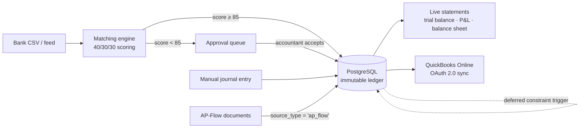

# LedgerCore — App Spec & Build Ladder

**Slug:** `ledger-core` · **Domain:** Core Accounting & Systems · **Phases:** 3–4, 6, 8–9
**Status: Phase 3, Phase 3.5 and Phase 3.6 shipped.** The GL core is live — chart of accounts, journal entries, reversing entries, trial balance, with the balance invariant and immutability enforced by database triggers — LedgerCore has a front door (onboarding, settings, dashboard), and now a journal register with filters plus a per-account ledger with running balances and chart-wide rollups. Phases 4, 6, 8 and 9 are unticked below. Keep this file verified against the filesystem, not against its own claims.

LedgerCore is the system of record. The other six apps do not keep their own ledgers — they post into this one through `journal_entries.source_type` / `source_id`, and read nothing of each other's tables ([guardrails.md](guardrails.md) rule 16).

The thesis it exists to demonstrate: **99% of bookkeepers cannot code, and 99% of engineers cannot explain a debit.** Everything below is chosen to sit on that seam — correct accounting, enforced by real engineering.

---

## Feature scope

### A. Enforced double-entry engine — Phase 3

- **Atomic zero-sum transactions.** Every financial event is at least two posting lines where `SUM(debits) − SUM(credits) = 0`. An unbalanced `POST` rolls the transaction back; nothing partial survives.
- **The invariant is enforced twice, at two layers.** `journalService` validates before writing, and a `DEFERRABLE INITIALLY DEFERRED` constraint trigger re-checks at `COMMIT`. The application being correct is not the reason the ledger balances — see [Why the trigger, given the service already checks](#why-the-trigger-given-the-service-already-checks).
- **Immutable append-only ledger.** No `UPDATE`, no `DELETE` on a posted entry — refused by trigger, not by convention, and there is no route that could offer one. Corrections are reversing entries carrying `reverses_entry_id` back to the original.
- **Multi-currency recorded from the first row.** Every line stores its native currency, the base-currency amounts, and the FX rate used on the transaction date. Phase 8 builds the engine that consumes this; Phase 3 refuses to write rows that would make Phase 8 impossible.

### B. Live financial statements — Phase 4

Computed by aggregation over raw `ledger_lines` on every request. **No pre-calculated summary tables, no nightly rollup job, no `account_balances` column that can drift from the lines it summarises.**

- **Trial balance** (Phase 3) — per-account debit and credit totals, type-aware `net_balance`, and an `isBalanced` flag that is integer equality.
- **Profit & Loss** — Revenue − Expenses, with gross profit split out via the `5xxx` COGS range.
- **Balance Sheet** — Assets = Liabilities + Equity, with current-period earnings folded into equity.
- **Fiscal periods** with close/lock, so a closed month cannot receive a late posting.
- **AR/AP subledgers** — receivable and payable detail reconciling to their control accounts.

### C. Bank reconciliation & confidence matching — Phase 6

- **Statement ingestion.** Messy real-world CSV exports: quoted fields containing commas and newlines, a BOM, inconsistent date formats, debit/credit in one signed column or two unsigned ones. Re-importing the same statement is idempotent via `UNIQUE (org_id, dedupe_hash)`.
- **Scoring engine.** Each bank line is scored against open AR/AP items out of 100:

  | Signal | Points | Rule |
  |---|---|---|
  | Amount | 40 | Exact integer-cent match |
  | Date | 30 | Within ±3 days of the document date, scaled by distance |
  | Counterparty | 30 | Levenshtein similarity on normalized name + memo |

- **Thresholds.** ≥85 is offered for one-click auto-reconciliation; anything below routes to the interactive approval queue. Every score stores its `score_breakdown` as JSONB, so a suggestion is explainable rather than a number the user is asked to trust.
- **Levenshtein is hand-written** in `utils/levenshtein.ts` — a rolling-array DP, `O(m×n)` time and `O(min(m,n))` space. No dependency, and the algorithm is one you can derive on a whiteboard.

### D. Multi-currency FX engine — Phase 8

- `fx_rates` keyed by `(base, quote, date)`, looked up as *the latest rate on or before* the transaction date — rate feeds have weekend and holiday gaps, so an exact-date match is a bug waiting for a Saturday.
- **Realized** gain/loss posted automatically on settlement, when the rate on the payment date differs from the rate on the invoice date.
- **Unrealized** revaluation of open foreign-currency balances at period end.

### E. QuickBooks Online sync — Phase 9

- OAuth 2.0 authorization-code flow, per-organization `realm_id`, tokens encrypted at rest and never logged.
- Push reconciled entries to `/v3/company/{realmId}/journalentry`.
- **Shipping honestly:** this phase is built against Intuit's documented API shape with `fetch` stubbed in tests. There is no sandbox account yet, so it lands as *wired, not verified against live Intuit*, and says exactly that until someone runs it against a real sandbox.

---

## The showcase items

### 1. Audit trail & internal controls — the CFO safety net

An append-only history stamping actor, timestamp, system source, and client IP on every financial write. The shared CDC trail is [Phase 5](roadmap.md); LedgerCore is its first consumer.

The mechanism worth explaining in an interview: **a Postgres trigger cannot see `req`.** It knows the row and the transaction, not who made the HTTP call. The actor reaches it through `SET LOCAL app.current_user_id = $1` and `SET LOCAL app.client_ip = $2` issued inside the same transaction, read back by the trigger with `current_setting('app.current_user_id', true)`. `SET LOCAL` scopes the value to the transaction, so a pooled connection handed to the next request carries nothing over.

Alongside it, `npm run verify:integrity` — a standalone checker asserting total debits equal total credits across the entire database, that every entry balances individually, and that no line is orphaned. It is the script you run in front of an auditor, and it must be capable of failing.

### 2. Multi-tenant chart of accounts

GAAP/IFRS account types with parent-child hierarchy — `1000 Assets → 1100 Current Assets → 1110 Operating Cash` — resolved with a `WITH RECURSIVE` CTE, cycle-checked before any re-parenting is accepted. Header accounts carry `is_postable = false` and are refused by trigger if anything tries to post to them.

Every organization gets its own copy of the [default chart](schema.md#default-chart-of-accounts) at registration, seeded inside the same transaction that creates the organization. Two organizations may both own account code `1110` and can never see each other's.

### 3. Realized FX — the worked example

An invoice raised for **$1,000 USD** on day 1 when USD/INR is **83.00**, settled on day 10 when it is **83.50**. Base currency is INR.

**Day 1 — invoice raised.** 1,000 × 83.00 = ₹83,000.

| Account | Debit | Credit |
|---|---|---|
| `1120` Accounts Receivable | ₹83,000.00 | |
| `4200` Service Revenue | | ₹83,000.00 |

**Day 10 — cash received.** The same $1,000 is now worth 1,000 × 83.50 = ₹83,500. The receivable was carried at ₹83,000, so ₹500 more came in than was booked.

| Account | Debit | Credit |
|---|---|---|
| `1110` Operating Cash | ₹83,500.00 | |
| `1120` Accounts Receivable | | ₹83,000.00 |
| `4910` Realized FX Gain | | ₹500.00 |

The entry balances because the FX line is what makes it balance — that is the whole point of the account. **Note the direction:** a *receivable* settled at a higher rate is a gain. The mirror case, the one in the original spec, is a $1,000 *payable*: you owe $1,000, booked at ₹83,000, and it costs ₹83,500 to clear, so you debit `6810 Realized FX Loss` ₹500. Same arithmetic, opposite sign, because a liability moves the other way.

All three amounts are `BIGINT` paise/cents. The rate is `NUMERIC(18,8)`. Nothing here is ever a float.

---

## Architectural differentiation

### Why the trigger, given the service already checks

Most applications enforce accounting rules in application code and describe that as "validated". It holds exactly as long as every write goes through that code path — and then someone writes a data-fix script, a migration backfills a column, an ORM bulk-updates, or a future module posts through a service that forgot a check.

A `DEFERRABLE INITIALLY DEFERRED` constraint trigger closes that off. It fires at `COMMIT` rather than per statement, so an entry's lines can be inserted one at a time without ever being transiently invalid, and it evaluates the same integer equality the service does. The result is that **an unbalanced entry cannot exist in the database**, regardless of what wrote it — including a hand-typed `INSERT` in `psql`.

That is the difference between a rule and an invariant, and it is worth being able to say out loud.

### Data flow

### Webhooks for financial events — Phase 7

An outbound notification when a watched condition fires: an unallocated transaction above a configured threshold reaching the ledger, for example. This lands in Phase 7 and not earlier for a specific reason — rule 5 forbids post-`COMMIT` follow-up work inside the posting function. An HTTP call to Slack cannot happen inside the transaction (it would hold the connection open on a network round trip, and a rollback could not un-send it), and firing it after `COMMIT` without a queue means a crash between the two silently loses the notification. So it needs the job queue, which is why it waits for one.

---

## Build ladder

Deliverables per phase. Acceptance criteria are the bar for ticking the phase, not aspirations.

### Phase 3 — GL core

- [x] `utils/money.ts` — branded `Cents`, parsing and formatting, no floats
- [x] `zod` adopted; `src/schemas/` layer + `utils/parseBody.ts` bridging zod errors to `ApiError(400)`
- [x] `002_ledger-core_accounts.sql` — `accounts` with `parent_id`, `is_postable`
- [x] `accountService` — list (tree and flat), create, re-parent with cycle check, `seedDefaultChart`
- [x] Chart seeded inside `/auth/register`'s existing transaction
- [x] `003_ledger-core_backfill_chart.sql` — the seed for every organization created in Phases 1–2
- [x] `004_ledger-core_journals.sql` — `journal_entries`, `ledger_lines`, both deferred constraint triggers, `reject_mutation()`, the `is_postable` guard
- [x] `journalService.createEntry` — one `BEGIN…COMMIT`, every statement on the checked-out client
- [x] `POST /:id/reverse` — the only correction path
- [x] `reportService.trialBalance` — type-aware `net_balance`, integer `isBalanced`
- [x] `express-rate-limit` on `/auth/login` and `/auth/register` — debt carried since Phase 1
- [x] Tailwind v4 + `lucide-react`; accounts, journal-entry and trial-balance pages; first real entry in `client/src/apps/registry.ts`
- [x] Cross-tenant isolation test under `__tests__/ledger-core/`

**Acceptance ✅ — all verified.** A hand-written `INSERT` of two unbalanced lines in `psql` succeeds on both inserts and fails at `COMMIT`. An entry with zero lines and an entry with one line both fail at `COMMIT`. `UPDATE`/`DELETE` on `journal_entries` and `ledger_lines` raise `0A000`. `SELECT SUM(debit_cents) - SUM(credit_cents) FROM ledger_lines` returns `0`. A second organization's account id under the first organization's session returns `404`, not `403`. Covered by `__tests__/ledger-core/ledgerConstraints.test.ts`, which writes raw SQL rather than going through the service.

**One thing Phase 3 does *not* claim.** Every line is written in the organization's base currency at `fx_rate = 1`. The currency columns exist and are populated, but nothing converts anything yet — the FX engine is Phase 8.

### Phase 3.5 — onboarding, settings & dashboard

A half-step between the GL core and live statements. Renumbers nothing; every box below Phase 4 stays exactly where it was.

- [x] `005_ledger-core_settings.sql` — `ledger_settings` (one row per org, keyed by `org_id`), plus `UNIQUE (org_id, id)` on `accounts` so `cash_account_id` carries a composite FK rather than a plain one
- [x] `settingsService.completeOnboarding` — one transaction, idempotent (resubmitting overwrites, never 409s), writes `organizations.name`/`base_currency` via `organizationService.updateOrganization` on the same client
- [x] The base-currency lock — `422` if any `ledger_lines` row exists and the submitted currency differs from the current one
- [x] `dashboardService.dashboardSummary` — position, year-to-date/month-to-date performance, a 6-point gap-filled trend, recent entries, integrity — one `FILTER`-aggregate scan plus a `generate_series` scaffold, **no summary table**
- [x] `GET/POST/PATCH /ledger-core/settings`, `GET /ledger-core/reports/dashboard`, `PATCH /organizations` (platform layer)
- [x] Client: sidebar navigation, onboarding wizard (3 steps), dashboard with a hand-rolled `TrendChart`, settings page, reports index (trial balance live, P&L/balance sheet marked "Phase 4")
- [x] Cross-tenant isolation tests for both `settings.test.ts` and `dashboard.test.ts`

**Acceptance ✅ — all verified.** A newly registered user picking LedgerCore is redirected to the wizard, never the chart of accounts; completing it once and reloading never shows the wizard again. `GET /ledger-core/settings` on a fresh organization returns `200` with `onboardedAt: null`, never `404`. Posting a journal entry after onboarding with a different base currency returns `422`; with the same currency, `200`. The dashboard's `trend` always has exactly 6 points, including months with no postings, at zero. Covered by `__tests__/ledger-core/{settings,dashboard}.test.ts`.

**What this phase does *not* claim.** `position.equationHolds` is not the Phase 4 balance sheet — it folds `currentEarningsCents` (Revenue − Expenses, all time) into the check by hand, because there is no period-end close to derive retained earnings from yet. No `fiscal_periods` row exists anywhere; `fiscal_year_start_month`/`_day` are a setting consumed in application code, not a table. The cash tile is `null` until an organization explicitly configures a cash account.

### Phase 3.6 — journal register & account ledger

A half-step, like 3.5. Renumbers nothing; every box below Phase 4 stays exactly where it was. **No migration** — every query here is served by tables and indexes Phase 3 already built.

- [x] `GET /ledger-core/journals` gains `page`/`limit`/`from`/`to`/`accountId`/`sourceType`/`q` filters, a shared predicate builder (`journalService.buildFilters`) so `totalCount` can never disagree with the returned page, and an `e.id DESC` pagination tiebreaker
- [x] Every `JournalEntry` gains `createdByName`/`createdByEmail` (denormalised from the platform `users` table), `reversedByEntryId` (the inverse of `reversesEntryId` — set on an original once it has been reversed), and `totalDebitCents`/`totalCreditCents`
- [x] `GET /ledger-core/accounts/:id/ledger` (new `accountLedgerService.ts`) — one postable account's opening balance, every line oldest-first with a running balance computed by a `SUM(...) OVER (...)` window function over the full filtered set (continues correctly across pages), period totals, closing balance, and the counterpart accounts on each entry. Header accounts refused with `422`
- [x] `GET /ledger-core/accounts/balances` — own and subtree-rollup balance for every account (including headers and inactive accounts), via a descendant-walking recursive CTE mirroring `wouldCreateCycle`'s ancestor walk in the opposite direction. Registered before `/:id` so `balances` is never matched as an account id
- [x] Client: `JournalEntryPage` split into `JournalsPage` (the register), `NewJournalEntryPage` (posting), `JournalDetailPage` (one entry — no edit/delete affordance, only Reverse); `AccountLedgerPage` (opening/closing balance tiles, filterable transaction table with a running balance); `AccountsPage` gains a balance column and links postable rows into their ledger
- [x] Cross-tenant isolation tests for all three: `journals.test.ts` (filter leakage, forged `orgId`), `accountLedger.test.ts` (another org's account id → `404`), `accounts.test.ts`'s new `describe('account balances')` (another org's balances stay zero)
- [x] Two study notes: [window-functions-and-running-totals.md](../study/postgresql/window-functions-and-running-totals.md) (new), extensions to [aggregating-a-ledger.md](../study/postgresql/aggregating-a-ledger.md), [recursive-ctes-and-hierarchies.md](../study/postgresql/recursive-ctes-and-hierarchies.md) and [routing-nested-and-dynamic-segments.md](../study/react/routing-nested-and-dynamic-segments.md)

**Acceptance ✅ — all verified.** `?from=`/`?to=`/`?accountId=`/`?q=` each narrow the register correctly and `totalCount` always matches the filtered page, asserted with a same-predicate pagination-stability test across 5 same-date entries. An account ledger's running balance continues correctly from page 1 into page 2 rather than restarting (asserted directly). A header account's `GET .../ledger` returns `422`; its `rollupBalanceCents` on `GET .../balances` still sums its whole subtree, and a leaf's rollup equals its own balance. `GET /accounts/balances` is not shadowed by `/:id`. 280 server tests (up from 230), 65 client tests (up from 51).

**What this phase does *not* claim.** No sequential, human-readable entry number (`JE-000123`) — the register shows the first 8 characters of the uuid instead; adding one needs a per-org sequence and a migration. A header account's balance rolls up; its *transaction list* does not — clicking a header still shows no ledger, by design. No CSV/PDF export. No fiscal periods, close/lock, P&L, or balance sheet — those are still entirely Phase 4.

### Phase 4 — live statements

- [ ] `fiscal_periods` with `EXCLUDE USING GIST` against overlap; close/lock transitions via an FSM table
- [ ] Posting into a closed period rejected by trigger
- [ ] `GET /reports/profit-and-loss`, `GET /reports/balance-sheet`, both date-ranged
- [ ] AR/AP subledgers reconciling to their control accounts

**Acceptance:** balance sheet satisfies Assets = Liabilities + Equity for a non-trivial fixture. No summary table exists anywhere in the schema. P&L over the full range plus the balance sheet at its end agree on retained earnings.

### Phase 6 — bank reconciliation

- [ ] CSV parser surviving quoted commas, embedded newlines, BOM, and mixed date formats
- [ ] Idempotent re-import via `dedupe_hash`
- [ ] `utils/levenshtein.ts` — rolling-array DP, unit-tested against known distances
- [ ] Scoring engine with stored `score_breakdown`
- [ ] Approval queue UI; one-click accept above 85

**Acceptance:** the same statement imported twice yields one set of rows. A known-good fixture of 100 bank lines scores with no false auto-reconcile above the threshold.

### Phase 8 — FX engine

- [ ] `fx_rates`, latest-on-or-before lookup
- [ ] Realized gain/loss posted on settlement
- [ ] Period-end unrealized revaluation

**Acceptance:** the [worked example](#3-realized-fx--the-worked-example) reproduces exactly, to the paisa, in a test.

### Phase 9 — QuickBooks sync

- [ ] OAuth 2.0 authorization-code flow, encrypted token storage, refresh handling
- [ ] Journal entry push with idempotency
- [ ] `fetch` stubbed in tests; no live call in CI

**Acceptance:** the phase is marked done only with an explicit note stating whether it has been run against a live Intuit sandbox. "Wired" and "working" are not the same claim.

---

## Not built yet

**Phases 4, 6, 8 and 9** — everything above their unticked boxes. Concretely, as of Phase 3.5:

- **No P&L and no balance sheet.** The trial balance is the only report.
- **No fiscal periods**, so nothing prevents a posting into a month you consider closed.
- **No FX conversion.** The columns are there; every line is base currency at rate 1.
- **No bank reconciliation, no QuickBooks sync.**
- **No audit trail.** `created_by` and `created_at` are stamped on every entry, but the CDC trail with actor and IP is Phase 5 — **no compliance claim is valid until it lands**, and the [showcase section above](#1-audit-trail--internal-controls--the-cfo-safety-net) describes a target, not a shipped feature.
- **No `verify:integrity` script** yet; the equivalent assertions currently live only in the test suite.

When a phase lands, tick its boxes and update [roadmap.md](roadmap.md), [api.md](api.md), [schema.md](schema.md) and `CLAUDE.md` in the same change. A doc that describes a feature which does not exist is the failure mode that killed the previous build ([guardrails.md](guardrails.md#appendix--lessons-from-the-discarded-build)).
